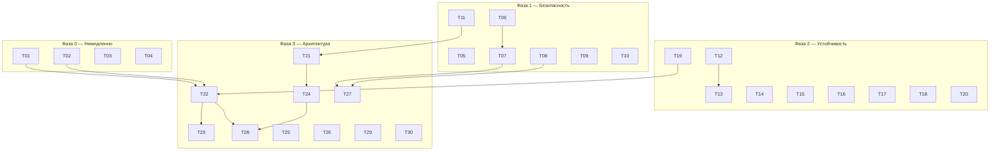

# Fable — план работ по итогам тотального ревью

Источник: [`@docs/reviews/2026-07-04-total-architecture-review.md`](../reviews/2026-07-04-total-architecture-review.md).

30 задач, разбитых на 4 фазы и отсортированных по критичности. Каждая задача — отдельный файл `TNN-*.md` с проблемой, затронутыми файлами, решением, критериями приёмки, тестами и зависимостями. Ссылки на находки (`C1`, `S2`, `A7`, …) ведут в исходный отчёт.

## Как читать

- **Приоритет:** P0 (критично, чинить немедленно) → P3 (косметика/долг).
- **Зависит от / Блокирует:** жёсткий порядок. **Связано:** мягкая связь (один файл, общая тема) — желательно делать рядом, но не обязательно.
- Внутри фазы задачи идут в рекомендованном порядке исполнения.

## Фазы

| Фаза | Когда | Задачи | Цель |
|------|-------|--------|------|
| **0 — Немедленно** | дни, до коммита текущего diff | T01–T04 | Остановить активные баги (стирание сессии, падение сохранения слова, скрытый баг контейнера) и закрыть незакоммиченный diff |
| **1 — Безопасность** | 1–2 недели | T05–T11 | Закрыть периметр admin-API, утечку отчётов, PII в логах, cost-guard моделей |
| **2 — Устойчивость и наблюдаемость** | ~месяц | T12–T20 | Алерты + readiness, безопасный деплой, устойчивость к Telegram/AI, горячие индексы, метеринг |
| **3 — Архитектурные инвестиции** | квартал | T21–T30 | Ликвидация двоевластия код/БД, распил god-модулей, фундамент мультиканальности, retention, чистка долга |

## Реестр задач

| # | Задача | Приор. | Фаза | Оценка | Зависит от | Находки |
|---|--------|--------|------|--------|-----------|---------|
| [T01](T01-mentor-session-validator.md) | Валидатор сессии убивает режим mentor | P0 | 0 | 0.5д | — | C1, B1 |
| [T02](T02-finish-out-of-set-diff.md) | Доделать и укрепить незакоммиченный diff out-of-set | P0 | 0 | 1д | — | B9 |
| [T03](T03-container-cast-estimatecost.md) | Убрать cast контейнера, выровнять `estimateCost` | P0 | 0 | 0.5д | — | C3 |
| [T04](T04-vocab-unique-index-soft-delete.md) | Частичный уникальный индекс словаря + реактивация | P0 | 0 | 1д | — | C2, E1 |
| [T05](T05-admin-login-rate-limit.md) | Rate-limit и anti-bruteforce на `/api/auth/login` | P0 | 1 | 1д | — | S2 |
| [T06](T06-admin-token-revocation.md) | Ревокация JWT / проверка `isActive` в рантайме | P1 | 1 | 1.5д | — | S4 |
| [T07](T07-admin-rbac-auth-hook.md) | RBAC + единый auth-хук (убрать 11 копий) | P1 | 1 | 1.5д | T06 | S8 |
| [T08](T08-admin-error-handler-query-validation.md) | Глобальный error-handler + zod на query | P1 | 1 | 1д | — | S9 |
| [T09](T09-close-public-reports.md) | Закрыть публичную утечку `public/reports` | P0 | 1 | 0.5д | — | S3 |
| [T10](T10-pino-redact-pii.md) | Redact PII/текстов в pino | P1 | 1 | 0.5д | — | S7 |
| [T11](T11-ai-model-guards.md) | Guard на удаление/смену default AI-модели | P1 | 1 | 1д | — | D2 |
| [T12](T12-readiness-and-alerts.md) | Readiness-healthcheck + алерты Grafana | P0 | 2 | 2д | — | C4, F1 |
| [T13](T13-deploy-health-gate-rollback.md) | Health-гейт деплоя + откат + expand/contract | P0 | 2 | 2д | T12 | C5, F2 |
| [T14](T14-telegram-429-403-resilience.md) | Устойчивость к Telegram 429/403 | P1 | 2 | 1.5д | — | B4, B5 |
| [T15](T15-safe-bot-catch.md) | Безопасный `bot.catch` с ответом пользователю | P1 | 2 | 0.5д | — | B3 |
| [T16](T16-unified-ai-credit-metering.md) | Единый метеринг кредитов для всех AI-вызовов | P1 | 2 | 3д | — | S1, S5 |
| [T17](T17-word-context-indexes.md) | Индексы горячего пути `word_context` | P1 | 2 | 1д | — | E2 |
| [T18](T18-check-then-insert-races.md) | Устранить гонки check-then-insert | P1 | 2 | 1.5д | — | E4, E8, E9 |
| [T19](T19-translationmap-eviction.md) | LRU-эвикция `translationMap` в сессии | P1 | 2 | 1д | — | B6 |
| [T20](T20-monitoring-pins-nginx-hardening.md) | Pin monitoring-образов + hardening nginx | P1 | 2 | 1.5д | — | F4, F5, S10 |
| [T21](T21-single-source-of-truth.md) | Ликвидация двоевластия код/БД | P1 | 3 | 5д | T11 | A2, A3, A4, A7, A8 |
| [T22](T22-refactor-translate-helper-di.md) | Распил `translate-mode.helper` + DI через `ctx.services` | P1 | 3 | 5д | T01, T02, T19 | B2, B7 |
| [T23](T23-translate-pipeline.md) | Конвейер шагов в `translate()` | P2 | 3 | 3д | T22 | A12 |
| [T24](T24-multichannel-identities.md) | Фундамент мультиканальности: identities + userId | P2 | 3 | 5д | T21 | A1, A13, A18 |
| [T25](T25-telemetry-retention-timezone.md) | Retention телеметрии + timezone-aware timestamps | P2 | 3 | 2д | — | E5, E6 |
| [T26](T26-migration-hygiene.md) | Уборка миграций (мёртвый 0015, журнал как SoT) | P2 | 3 | 1д | — | E7 |
| [T27](T27-admin-service-layer-contracts.md) | Сервисный слой admin-api + пакет контрактов | P2 | 3 | 3д | T07, T08 | D3, D4 |
| [T28](T28-dep-cruiser-allowlist.md) | Allowlist-правила dependency-cruiser | P2 | 3 | 1.5д | T22, T24 | A14 |
| [T29](T29-core-hygiene-batch.md) | Пакет чистки долга в core | P3 | 3 | 3д | — | A5, A9–A11, A15–A21 |
| [T30](T30-longtail-cleanup.md) | Долгий хвост low-risk правок | P3 | 3 | 3д | — | B8, B10–B15, D5, D6, E10, F6–F10, S6, S11, S12 |

## Граф зависимостей (жёсткие связи)

## Критический путь

Самая длинная цепочка зависимостей, определяющая минимальный срок:

`T02 → T22 → T23` (доделать diff → распилить helper и внедрить DI → конвейер translate).
Параллельно: `T11 → T21 → T24` (guard моделей → единый источник правды → мультиканальность) и `T12 → T13` (алерты → безопасный деплой).

Фазы 0–1 почти полностью параллелятся (жёсткая связь только T06→T07). Начинать можно с любого P0.

## Сквозные темы (какие задачи их закрывают)

- **Двоевластие код/БД** → T11, T21 (и частично T03).
- **AI-вызовы вне квоты** → T16 (и guard T11).
- **Наблюдаемость без реакции** → T12, T13.
- **Check-then-insert гонки** → T04, T18.
- **God-модули и copy-paste** → T22, T23, T27, T29.
- **Telegram-идентичность в ядре** → T24.
- **Отсутствие retention** → T25, T17.
